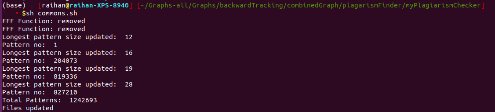

## Working files

### Check data-mining_results.md file for every steps

`2plag.py` will find the plagiarism between two/multiple files.
`removeCommons.py` will remove the common patterns between the files. Details following,
```
# It will take this input
remove_common_lines('output', 'f1.txt', 'f2.txt')
```
 - `findPlag.sh` :- The output will be generated by `2plag.py` file. This can be done by running `findPlag.sh > output`
 - `commons.sh` :- Then this file will first run 2 files to convert the data by removing `FFF Function:`. After that it will run the `removeCommons.py` file to remove the common patterns between those files. 



### Longest common pattern found
Pattern no: 827210
Pattern size: 28
```
Pattern: 827210

 _ZN4mqtt10buffer_refIcEC2EPKcj

 _ZN4mqtt10buffer_refIcEC2EONSt7__cxx1112basic_stringIcSt11char_traitsIcESaIcEEE

 _ZN4mqtt12make_messageENS_10buffer_refIcEES1_

 _ZN4mqtt10buffer_refIcEC2EOS1_

 _ZN4mqtt10buffer_refIcEC2EOS1_

 _ZN4mqtt7message6createENS_10buffer_refIcEES2_

 _ZN4mqtt10buffer_refIcEC2EOS1_

 _ZN4mqtt10buffer_refIcEC2EOS1_

 _ZNK4mqtt10buffer_refIcE5emptyEv

 _ZN4mqtt7message12validate_qosEi

 _ZN4mqtt7message12set_retainedEb

 _ZN4mqtt6to_intEb

 _ZN4mqtt10buffer_refIcED2Ev

 _ZN4mqtt10buffer_refIcED2Ev

 _ZN4mqtt10buffer_refIcED2Ev

 _ZN4mqtt10buffer_refIcED2Ev

 _ZN4mqtt10buffer_refIcED2Ev

 _ZN4mqtt10buffer_refIcED2Ev

 _ZN4mqtt7message7set_qosEi

 _ZN4mqtt7message12validate_qosEi

 _ZN4mqtt7message12set_retainedEb

 _ZN4mqtt6to_intEb

 _ZNK4mqtt7message9get_topicB5cxx11Ev

 _ZNK4mqtt10buffer_refIcEcvbEv

 _ZNK4mqtt10buffer_refIcE3strB5cxx11Ev

 _ZNK4mqtt7message9get_topicB5cxx11Ev

 _ZNK4mqtt10buffer_refIcEcvbEv

 _ZNK4mqtt10buffer_refIcE3strB5cxx11Ev

```

Now, to find the graph containing these pattern, head over to this directory,
```
/home/raihan/Graphs-all/Graphs/backwardTracking/combinedGraph/hbw-graph
```
And run following, 
```
rg -l "buffer_ref" | xargs rg -l "make_message" | xargs rg -l "message6create" | xargs rg -l "message12validate" | xargs rg -l "message12set_retained" | xargs rg -l "to_int" | xargs rg -l "message7set_qos" | xargs rg -l "message9get_topic" *.dot
```
`xargs` will take the output and use it as input for the second. `-l` option will display only the names of the file. 

After running this command, the 1st graph in the output should contain the pattern. Like i found following graph `hbw-graph-232.dot` 


## Noises removed
`hbwall3.txt` file total functions initially: 74011
After removing noise `f1.txt`/`updatedHBW-shared.txt` file has total functions: 73514
