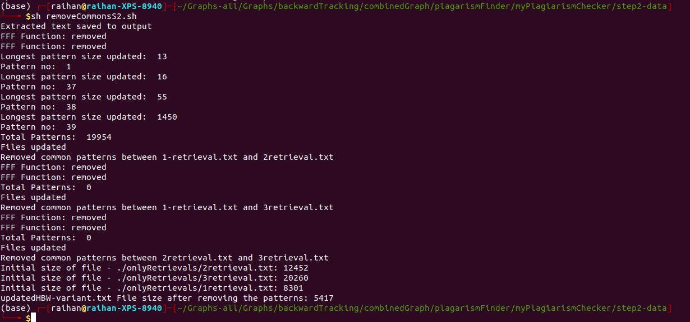

# Variant common pattern

After removing the common patterns from the shared files `hbw, vgr`. Now, removing the common patterns between multiple variants - from 3 `hbw` retrievals. All the retrievals are present inside the `onlyRetrievals` folder.
Do following to remove the common patterns.
```
# it will get the common patterns by checking with plagiarism checker and save the 1st line of commons inside 'commonPatternInMultipleVariants' - all the patterns found will have same text - check after "Similarity"
sh step2.sh 

# Now, this script will remove the common patterns and save the output in f1.txt and updatedHBW.txt file
removeCommonsS2.sh
```

The `extractCommons.sh` will extract only the 1st similar common patterns. Because all the patterns listed are same.


