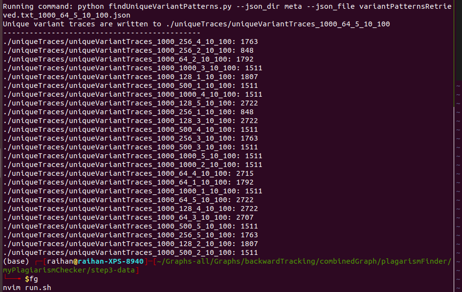

## Get the unique variant patterns from file 
Step-3 is to remove the low-level details from the common patterns found in step 2, which is retrieving only the common patterns between multiple variants.
In step-2, the common patterns are found inside `../step2-data/patterns/patterns.txt` file. 
This `retrieveVariantPatterns.py` file will remove the unwanted text and extracts only the functions and writes to `variantPatternsRetrieved.txt`.
Then the `frequentPattern2.py` will get the frequent patterns from the file `variantPatternsRetrieved.txt` and write the output inside the meta folder. 
Then the json file will be given as input to the `findUniqueVariantPatterns.py` file and it will convert the json file into a set removing the repetitive text. After that it will remove the low level traces and write it at `uniqueTraces`
```
# extracts only functions from patterns.txt found in step2 and write to variantPatternsRetrieved.txt
python retrieveVariantPatterns.py 

# Find common pattern and write to meta
python frequentPattern2.py --fname variantPatternsRetrieved.txt --min_len 5 --stride 256 --seq_len 1000

# remove these low-level details from the json files and writes to uniqueTraces
python findUniqueVariantPatterns.py --json_dir meta --json_file variantPatternsRetrieved.txt_1000_256_5_10_100.json 
```

## script run.sh

The script `run.sh` will simply follow all the steps and extract the updated traces inside the `uniqueTraces` folder. 
Currently, the minimum trace files are `./uniqueTraces/uniqueVariantTraces_1000_256_1_10_100: 848` and `./uniqueTraces/uniqueVariantTraces_1000_256_2_10_100: 848`
Execute this command `sh run.sh`


