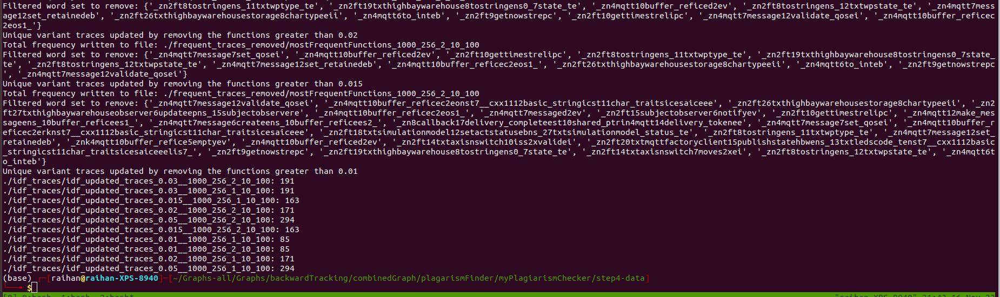

# Step4 - purpose is to remove the highly frequent functions with IDF
IDF (Inverse Document Frequency) is a measure of how common or rare the word is across all the observations.

I am using the `TfidfVectorizer` module of python to implement this `Tfidf`, which stands for Term Frequency-Inverse Document Frequency. 

 - The `idf.py` file will get the word frequencies first, uses this directory files as input `../step3-data/uniqueTraces`
 - Then it will store the `{word} : {frequency}` inside the `./frequent_traces_removed` folder. 
 - After that, it will create a set from the input `--freq_to_remove` and remove those words from the input file.
 - The output will be saved inside the `./inf_trace` directory

Run this file,
```
python idf.py --fname uniqueVariantTraces_1000_256_1_10_100 --freq_to_remove 0.05
```

## run.sh script will do everything
According to the README.md of `../step3-data` the following files has minimum traces will most important functions,
```
uniqueVariantTraces_1000_256_1_10_100" "uniqueVariantTraces_1000_256_2_10_100
```

The `run.sh` script will run the program `idf.py` with frequencies `"0.05" "0.03" "0.02" "0.015" "0.01"` and output will be saved inside the `./idf_traces` directory.

Run the script like following,
```
bash run.sh
```


